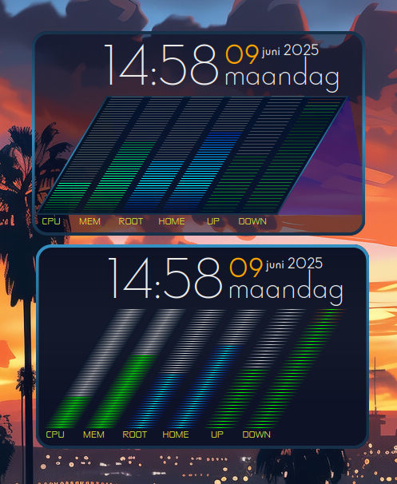

# Conky Bars
## A Conky configuration displaying a clock and bars for CPU, memory, disk, and network usage.



## Requirements
- **Conky**: Conky must be installed on your system. Refer to [Conky's installation guide](https://github.com/brndnmtthws/conky).
- **Cairo**: The script uses the Cairo graphics library for rendering images. Ensure Cairo is installed on your system.
- On some systems, you may need the `cairo-xlib` module. If unavailable, it will fall back gracefully.

---

## Installation
1. Clone the repository:
   ```bash
   git clone https://github.com/wim66/Conky-Bars.git
   ```

This project is licensed under the GPL-3.0 license. See the LICENSE file for details.

---

Created by Willem [@wim66](https://github.com/wim66).
